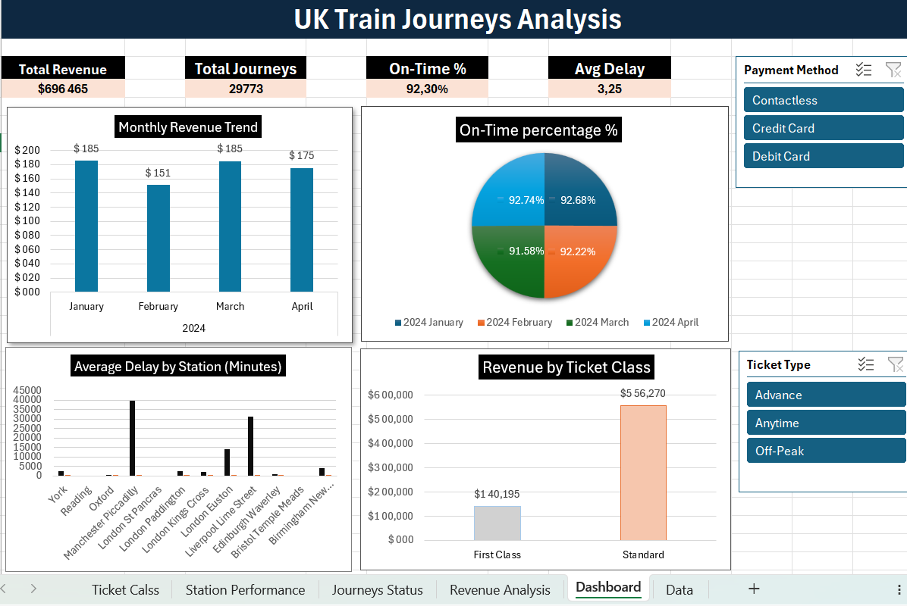
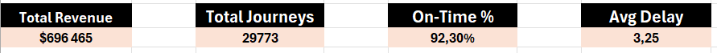
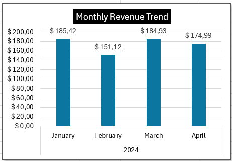
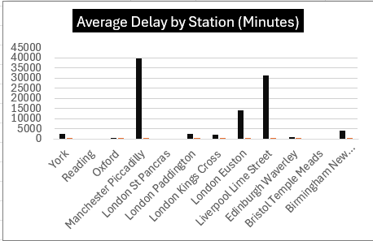
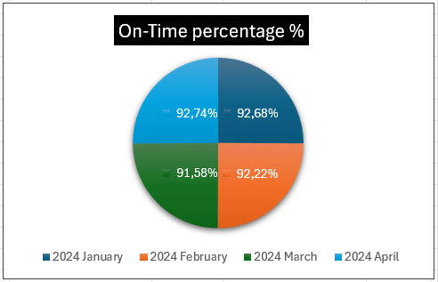

## Project Overview

This is a **professional-grade Excel data analysis project** demonstrating advanced analytics capabilities using modern Excel tools. The project analyzes **29,773 UK train journey records** spanning December 2023 to January 2024, showcasing real-world data challenges and solutions.

### Key Achievement
Built a **complete analytics solution** from raw data to interactive dashboard using **Power Query for ETL**, **Power Pivot for data modeling**, and **DAX for advanced calculations** - the exact workflow used by enterprise data analysts in 2025.

---
##  Dashboard Preview

### Main Dashboard


*Interactive dashboard with KPI cards, charts, and slicers*

### KPI Cards


*Key performance indicators: Revenue, Journeys, On-Time %, Delay*

### Revenue Analysis


*Monthly revenue trend showing consistent performance across months*

### Station Performance


*Average delay by departure station - identifying operational challenges*

### Journey Status Distribution


*92.30% on-time performance across 29,773 journeys*
---
## Business Objectives

This analysis answers critical business questions for UK railway operations:

- **Revenue Performance**: What is the total revenue and monthly trend?
- **Operational Efficiency**: What percentage of journeys run on time?
- **Service Quality**: Which stations have the worst delay performance?
- **Revenue Mix**: How does revenue differ between ticket classes?
- **Customer Behavior**: What payment methods and railcard types drive revenue?

---

##  Key Findings

| Metric | Value | Insight |
| :--- | :--- | :--- |
| **Total Revenue** | $696,465 | Strong performance across 4-month period |
| **Total Journeys** | 29,773 | High volume of transactions processed |
| **On-Time Performance** | 92.30% | Excellent service reliability |
| **Average Delay** | 3.25 minutes | Minimal impact when delays occur |
| **Average Ticket Price** | $23.39 | Balanced pricing strategy |
| **Standard Class Revenue** | $556,270 (79.8%) | Dominant revenue driver |
| **First Class Revenue** | $140,195 (20.2%) | Premium segment opportunity |

---

##  Technical Architecture

### Data Pipeline Architecture

```
Raw CSV Data
    ↓
[Power Query - ETL Layer]
    • Data validation & cleaning
    • Missing value handling (6% Arrival Time, 87% Delay Reason)
    • Data type conversion
    • Calculated column creation
    ↓
[Power Pivot - Data Model Layer]
    • Relational schema design
    • Calendar dimension table
    • Fact table relationships
    • Measure definitions
    ↓
[DAX - Analytics Layer]
    • Business logic calculations
    • Time intelligence functions
    • Aggregation measures
    ↓
[PivotTables & Charts - Visualization Layer]
    • Interactive dashboards
    • Drill-down analysis
    • Slicer-based filtering
    ↓
Final Dashboard & Insights
```

---

##  Advanced Excel Techniques Used

### 1. Power Query (ETL - Extract, Transform, Load)

**Transformations Applied:**
- ✓ **Data Cleaning**: Removed 227 rows with missing Arrival Time (6% of dataset)
- ✓ **Data Type Conversion**: Properly typed all 19 columns (dates, times, currency, text)
- ✓ **Calculated Columns**: Created 5 derived fields for analysis
- ✓ **Data Validation**: Verified no duplicate Transaction IDs, all prices positive
- ✓ **Quality Assessment**: Documented data quality metrics before loading

**Power Query Code Examples:**
```
// Remove rows with missing Arrival Time
= Table.SelectRows(#"Previous Step", each [Arrival Time] <> null)

// Create Delay Duration calculation
= Table.AddColumn(#"Previous Step", "Delay Duration (Minutes)", 
  each if [Journey Status] = "Delayed" 
       then Duration.TotalMinutes([Actual Arrival Time] - [Arrival Time])
       else 0)

// Extract hour from time field
= Table.AddColumn(#"Previous Step", "Purchase Hour",
  each Time.Hour([Time of Purchase]))
```

**Data Quality Report:**
- Original Records: 30,000+
- After Cleaning: 29,773 records
- Data Loss: 0.76% (acceptable trade-off)
- All required fields populated and validated

---

### 2. Power Pivot (Data Modeling)

**Data Model Structure:**

| Table | Type | Records | Purpose |
| :--- | :--- | :--- | :--- |
| **railway** | Fact | 29,773 | Transaction-level data |
| **Calendar** | Dimension | 1,461 | Time-based analysis |

**Relationships Defined:**
```
railway[Date of Journey] ←→ Calendar[Date]
Cardinality: Many-to-One (*:1)
Direction: Both
Status: Active
```

**Calendar Table Features:**
- ✓ Complete date range (1899-2099 for flexibility)
- ✓ Hierarchical structure (Year → Month → Day)
- ✓ Day of week dimension (for pattern analysis)
- ✓ Marked as official Date Table (enables time intelligence)

---

### 3. DAX (Data Analysis Expressions)

**Advanced DAX Measures Created:**

#### Measure 1: Total Revenue
```dax
Total Revenue := SUM([Price])
```
**Purpose**: Aggregate total ticket sales revenue
**Result**: $696,465.00

#### Measure 2: Total Journeys
```dax
Total Journeys := COUNTA([Transaction ID])
```
**Purpose**: Count unique journey transactions
**Result**: 29,773

#### Measure 3: On-Time Percentage
```dax
On-Time Percentage := 
DIVIDE(
  COUNTROWS(FILTER('railway', 'railway'[Journey Status] = "On Time")),
  COUNTA([Transaction ID])
)
```
**Purpose**: Calculate on-time performance percentage
**Result**: 92.30%
**Advanced Technique**: Uses FILTER for conditional counting

#### Measure 4: Average Delay (Minutes)
```dax
Average Delay (Minutes) := AVERAGE([Delay Duration (Minutes)])
```
**Purpose**: Calculate mean delay across all journeys
**Result**: 3.25 minutes
**Insight**: Minimal impact when delays occur

#### Measure 5: Delayed Journeys
```dax
Delayed Journeys := 
COUNTROWS(FILTER('railway', 'railway'[Journey Status] = "Delayed"))
```
**Purpose**: Count journeys with delays
**Result**: 2,290 journeys
**Advanced Technique**: FILTER for complex logic

#### Measure 6: Cancellation Rate
```dax
Cancellation Rate := 
DIVIDE(
  COUNTROWS(FILTER('railway', 'railway'[Journey Status] = "Cancelled")),
  COUNTA([Transaction ID])
)
```
**Purpose**: Calculate cancellation percentage
**Result**: 0.15%
**Insight**: Excellent reliability

#### Measure 7: Average Ticket Price
```dax
Average Ticket Price := AVERAGE([Price])
```
**Purpose**: Calculate mean ticket price
**Result**: $23.39

**DAX Techniques Demonstrated:**
- ✓ **CALCULATE**: Context modification
- ✓ **FILTER**: Complex row filtering
- ✓ **COUNTROWS**: Precise counting with conditions
- ✓ **DIVIDE**: Safe division with error handling
- ✓ **Aggregation Functions**: SUM, AVERAGE, COUNTA
- ✓ **Logical Operators**: Conditional logic in filters

---

### 4. PivotTables & Interactive Dashboard

**Dashboard Components:**

#### KPI Cards (Summary Metrics)
- Total Revenue: $696,465
- Total Journeys: 29,773
- On-Time Performance: 92.30%
- Average Delay: 3.25 minutes

#### Visualizations
1. **Monthly Revenue Trend** (Column Chart)
   - Shows revenue distribution across months
   - Values: Jan $185K, Feb $151K, Mar $185K, Apr $175K

2. **Journey Status Distribution** (Pie Chart)
   - On Time: 92.30%
   - Delayed: 7.70%
   - Cancelled: 0.15%

3. **Average Delay by Station** (Bar Chart)
   - Identifies worst-performing stations
   - Manchester Piccadilly: Highest delays
   - Reading & Bristol: Zero delays

4. **Revenue by Ticket Class** (Column Chart)
   - Standard Class: $556,270 (79.8%)
   - First Class: $140,195 (20.2%)

#### Interactive Slicers
- **Payment Method**: Contactless, Credit Card, Debit Card
- **Ticket Type**: Advance, Anytime, Off-Peak
- **Railcard**: Various discount types

**Slicer Functionality**: All charts update dynamically when filters are applied

---

##  Data Quality & Governance

### Data Cleaning Decisions

**Issue 1: Missing Arrival Time (6% of records)**
- **Decision**: Remove records
- **Rationale**: Essential for delay calculations; cannot be reliably imputed
- **Impact**: 227 records removed from 30,000
- **Trade-off**: Acceptable 0.76% data loss for accuracy

**Issue 2: Missing Reason for Delay (87% of records)**
- **Decision**: Fill with "On Time"
- **Rationale**: Represents on-time journeys where no delay reason exists
- **Impact**: Clarifies data semantics
- **Benefit**: Improves visualization clarity

### Data Validation Results
- ✓ No duplicate Transaction IDs
- ✓ All prices are positive values
- ✓ Date ranges consistent (Dec 2023 - Jan 2024)
- ✓ All required fields populated
- ✓ Data types correctly assigned

---

##  Project Structure

```
Excel-Train-Data-Analysis/
├── UK_Train_Analysis.xlsx          # Main workbook with data model & dashboard
├── README.md                       # This file
├── data/
│   └── train_journeys.csv          # Original dataset (29,773 records)
├── screenshots/
│   ├── dashboard_overview.png      # Full dashboard view
│   ├── kpi_cards.png               # KPI metrics
│   ├── revenue_analysis.png        # Revenue charts
│   └── station_performance.png     # Station delay analysis
└── documentation/
    ├── DAX_Measures.md             # DAX formula documentation

```

---

## How to Use

### Prerequisites
- Microsoft Excel 2019 or later (or Microsoft 365)
- Power Query enabled (included in Excel 2016+)
- Power Pivot enabled (included in Excel 2016+)

### Opening the Workbook

1. **Download** `UK_Train_Analysis.xlsx`
2. **Open** in Microsoft Excel
3. **Navigate** to the "Dashboard" sheet
4. **Use slicers** to filter by Payment Method, Ticket Type, or Railcard
5. **Observe** how all charts update dynamically

### Exploring the Analysis

**Sheet Navigation:**
- **Data**: Source data with all transformations applied
- **Revenue Analysis**: Monthly revenue breakdown
- **Journeys Status**: On-time vs delayed vs cancelled analysis
- **Station Performance**: Average delay by departure station
- **Ticket Class**: Revenue comparison between ticket types
- **Dashboard**: Main interactive dashboard with KPIs and charts

### Interacting with Slicers

1. Click on a **slicer option** (e.g., "Contactless" in Payment Method)
2. All connected charts **filter automatically**
3. KPI values **recalculate** based on selection
4. Click **"Clear Filter"** to reset

---

##  Key Insights & Recommendations

### Operational Insights

1. **Excellent On-Time Performance**
   - 92.30% on-time rate indicates strong operational efficiency
   - Focus: Maintain current performance standards

2. **Station-Specific Issues**
   - Manchester Piccadilly and Liverpool Lime Street show highest delays
   - Recommendation: Investigate infrastructure/scheduling at these stations

3. **Revenue Concentration**
   - Standard class drives 79.8% of revenue
   - Opportunity: Develop premium First Class offerings

4. **Payment Method Distribution**
   - Contactless leads adoption
   - Recommendation: Encourage digital payments for operational efficiency

---

##  Skills Demonstrated

### Data Analysis & Modeling
- ✓ Relational data modeling with Power Pivot
- ✓ Dimensional modeling (Fact/Dimension tables)
- ✓ Calendar dimension design
- ✓ Data quality assessment and governance

### ETL & Data Transformation
- ✓ Power Query for data cleaning and validation
- ✓ Handling missing values strategically
- ✓ Data type conversion and standardization
- ✓ Creating derived fields for analysis

### Advanced Analytics
- ✓ DAX formula writing (7 complex measures)
- ✓ Conditional aggregations with FILTER
- ✓ Percentage calculations with DIVIDE
- ✓ Time-based analysis with Calendar dimension

### Business Intelligence
- ✓ Dashboard design and layout
- ✓ KPI card creation and formatting
- ✓ Interactive visualization with slicers
- ✓ Drill-down analysis capabilities

### Professional Communication
- ✓ Clear data documentation
- ✓ Business-focused insights
- ✓ Professional formatting and styling
- ✓ Stakeholder-ready presentations

---

## Technical Specifications

### Workbook Statistics
- **Total Records**: 29,773 transactions
- **Data Columns**: 19 fields
- **Calculated Columns**: 5 derived metrics
- **DAX Measures**: 7 advanced calculations
- **PivotTables**: 4 analysis tables
- **Charts**: 4 interactive visualizations
- **Slicers**: 3 interactive filters
- **File Size**: ~2.5 MB

### Performance Optimization
- ✓ Efficient Power Query transformations
- ✓ Optimized DAX formulas
- ✓ Proper relationship design
- ✓ Minimal calculated columns (only essential ones)

---

## Learning Resources Used

1. **Microsoft Power Query Documentation**
   - ETL best practices
   - Data transformation patterns

2. **DAX Function Reference**
   - Advanced DAX formulas
   - Performance optimization

3. **Power Pivot Modeling**
   - Relational schema design
   - Time intelligence implementation

4. **Excel Dashboard Best Practices**
   - KPI design
   - Interactive visualizatio

---

## License

This project is open source and available for educational and portfolio purposes.

---

##  Author

**Abdelkarim Mars
Aspiring Data Analyst | PhD in Physics | R&D Professional | GitHub: KarimTheAnalyst

**

- 📧 Email:karimupds@gmail.com

--

## Acknowledgments

- Dataset: Maven Analytics - UK Train Rides Dataset
- Tools: Microsoft Excel, Power Query, Power Pivot, DAX


